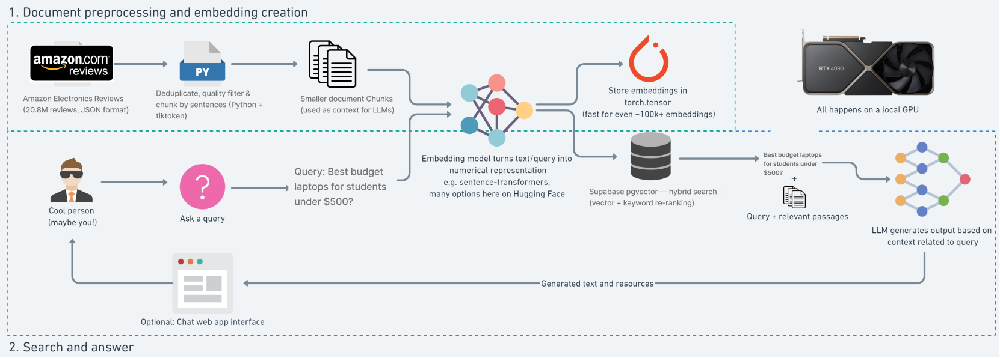
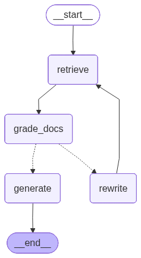

# CSSM — Amazon Electronics Product Assistant

A self-correcting RAG chatbot that recommends Amazon electronics products using real customer reviews. Built with **LangGraph**, **Supabase pgvector**, **OpenAI**, and a **Next.js** frontend with real-time streaming.

## Architecture

### RAG Pipeline Overview



### LangGraph Self-Correcting Pipeline



If retrieved documents are graded as irrelevant, the pipeline rewrites the query and retries retrieval (up to 2 times) before generating a response.

## Features

- **LangGraph RAG pipeline** with document grading and query rewriting
- **Hybrid search** — 70% vector similarity + 30% keyword (BM25-style) re-ranking
- **SSE streaming** — token-by-token response with source citations
- **Conversation memory** — maintains context across follow-up questions
- **Rate limiting** — 10 requests/minute per IP
- **API key authentication** — optional, header-based
- **19 pytest tests** — mocked dependencies, no external services needed
- **CI/CD** — GitHub Actions (backend tests + frontend build)
- **Docker** — multi-stage builds for both backend and frontend

## Tech Stack

| Layer | Technology |
|-------|-----------|
| Frontend | Next.js 15, React 19, TypeScript, Tailwind CSS |
| Backend | FastAPI, Python 3.10+ |
| RAG Pipeline | LangGraph, LangChain |
| Vector DB | Supabase (pgvector) |
| Embeddings | OpenAI `text-embedding-3-small` (1536 dims) |
| LLM | OpenAI `gpt-4o-mini` |
| Monitoring | LangSmith (optional) |
| CI/CD | GitHub Actions |
| Containerization | Docker, docker-compose |

## Quick Start

### Prerequisites

- Python 3.10+
- Node.js 18+
- [Supabase](https://supabase.com) account (free tier works)
- [OpenAI](https://platform.openai.com/api-keys) API key

### 1. Setup Supabase

Create a Supabase project, then run the contents of [`supabase_setup.sql`](supabase_setup.sql) in the **SQL Editor**. This creates the `chunks` table and search functions (`match_documents`, `hybrid_search`).

### 2. Configure Environment

```bash
cp env.template .env
```

Fill in your credentials:

```env
SUPABASE_URL=https://your-project.supabase.co
SUPABASE_SERVICE_ROLE_KEY=your_service_role_key
OPENAI_API_KEY=your_openai_key
```

### 3. Install & Run Backend

```bash
# Using uv (recommended)
uv venv && uv pip install -r requirements.txt
source .venv/bin/activate  # or .venv\Scripts\activate on Windows

# Ingest data (first time only)
python -m data_ingestion.data_ingestion

# Start server
python main.py
```

Backend runs at `http://localhost:8001`

### 4. Install & Run Frontend

```bash
cd rag-chat
npm install
npm run dev
```

Frontend runs at `http://localhost:3000`

## Project Structure

```
cssm/
├── main.py                          # FastAPI server (rate limiting, auth, SSE)
├── graph/
│   └── rag_graph.py                 # LangGraph pipeline (retrieve → grade → generate/rewrite)
├── retriever/
│   └── retrieval.py                 # Supabase vector + hybrid search
├── prompts/
│   └── prompt.py                    # RAG generation, grading, rewrite prompts
├── utils/
│   └── model_loader.py              # Multi-provider model loader
├── config/
│   ├── config.yaml                  # App configuration
│   └── config_loader.py             # YAML config loader
├── data_ingestion/
│   └── data_ingestion.py            # JSONL → chunk → embed → Supabase pipeline
├── tests/
│   ├── conftest.py                  # Fixtures with mocked RAG graph
│   ├── test_health.py               # Health endpoint tests
│   ├── test_auth.py                 # API key auth tests
│   ├── test_retrieve.py             # Chat endpoint tests
│   └── test_stream.py               # SSE streaming tests
├── test/
│   ├── test_embeddings.py           # Retrieval quality test harness
│   ├── visualize_graph.py           # LangGraph diagram generator
│   └── data-estimate.py             # Cost/storage estimator
├── rag-chat/                        # Next.js frontend
│   ├── src/
│   │   ├── app/
│   │   │   ├── page.tsx             # Main page
│   │   │   ├── layout.tsx           # Root layout
│   │   │   └── globals.css          # Global styles
│   │   ├── components/
│   │   │   └── ChatInterface.tsx    # Chat UI with SSE + source citations
│   │   └── utils/
│   │       └── sounds.ts            # Web Audio sound effects
│   └── package.json
├── Dockerfile                       # Backend container
├── rag-chat/Dockerfile              # Frontend container (multi-stage)
├── docker-compose.yml               # Local orchestration
├── .github/workflows/ci.yml         # CI pipeline
├── supabase_setup.sql               # Database schema + RPC functions
├── env.template                     # Environment variable documentation
├── requirements.txt
└── pyproject.toml
```

## API Endpoints

### `GET /health`

Health check.

```bash
curl http://localhost:8001/health
```

### `POST /retrieve`

JSON response with answer + sources.

```bash
curl -X POST http://localhost:8001/retrieve \
  -H "Content-Type: application/x-www-form-urlencoded" \
  -H "X-API-Key: your_key" \
  -d "msg=best budget laptops&chat_history="
```

### `POST /stream`

SSE streaming — token-by-token response.

```bash
curl -N -X POST http://localhost:8001/stream \
  -H "Content-Type: application/x-www-form-urlencoded" \
  -H "X-API-Key: your_key" \
  -d "msg=best budget laptops&chat_history="
```

SSE events: `sources` → `token` (repeated) → `done`

## Configuration

### `config/config.yaml`

```yaml
embedding_model:
  provider: "openai"
  model: "text-embedding-3-small"
  dimensions: 1536

llm_model:
  provider: "openai"
  model: "gpt-4o-mini"
  temperature: 0.2

retriever:
  top_k: 3
  hybrid: true              # vector + keyword search
  semantic_weight: 0.7      # 70% vector, 30% keyword

graph:
  max_retries: 2            # query rewrite attempts
```

### Environment Variables

| Variable | Required | Description |
|----------|----------|-------------|
| `SUPABASE_URL` | Yes | Supabase project URL |
| `SUPABASE_SERVICE_ROLE_KEY` | Yes | Supabase service role key |
| `OPENAI_API_KEY` | Yes | OpenAI API key |
| `API_KEY` | No | API key for endpoint auth (disabled if empty) |
| `CORS_ORIGINS` | No | Comma-separated allowed origins |
| `PORT` | No | Server port (default: 8001) |
| `LANGCHAIN_TRACING_V2` | No | Enable LangSmith tracing (`true`) |
| `LANGCHAIN_API_KEY` | No | LangSmith API key |

## Data Ingestion

The pipeline processes the [Amazon Reviews 2023 dataset](https://amazon-reviews-2023.github.io/) (Electronics category, ~20.8M reviews):

1. **Stream-reads** JSONL line-by-line (handles 6.6GB+ files)
2. **Deduplicates** — groups by product, keeps top reviews by helpful_vote
3. **Quality filters** — skips short reviews, enforces min token count
4. **Chunks** — sentence-based splitting with overlap for long reviews
5. **Embeds** — batches of 100 via OpenAI `text-embedding-3-small`
6. **Inserts** — batches of 200 into Supabase `chunks` table
7. **Resumes** — skips products already ingested

```bash
# Dry run (estimate cost/storage)
python test/data-estimate.py

# Full ingestion
python -m data_ingestion.data_ingestion
```

## Testing

```bash
# Run all 19 tests (no external services needed)
pytest

# Retrieval quality check (requires Supabase + OpenAI)
python test/test_embeddings.py
```

## Docker

```bash
# Run both services locally
docker-compose up --build

# Or build individually
docker build -t cssm-backend .
docker build -t cssm-frontend rag-chat/
```

## Deployment

**Backend** → GCP Cloud Run (free tier: 2M requests/month)
**Frontend** → Vercel (free hobby tier)

Set environment variables in each platform's dashboard — no `.env` files on servers.

## Dataset

[Amazon Product Reviews 2023](https://amazon-reviews-2023.github.io/) by McAuley Lab, UC San Diego.

```bibtex
@article{hou2024bridging,
  title={Bridging Language and Items for Retrieval and Recommendation},
  author={Hou, Yupeng and Li, Jiacheng and He, Zhankui and Yan, An and Chen, Xiusi and McAuley, Julian},
  journal={arXiv preprint arXiv:2403.03952},
  year={2024}
}
```

## License

MIT
